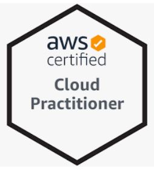

## INTRODUCTION
If you have no previous IT background, AWS Certified Cloud Practitioner course is the first exam to take to start your Cloud journey. The AWS Certified Cloud Practitioner (CCP) is the easiest Amazon Web Services certification. It’s a cloud beginner-friendly certification that covers the basics of AWS and the cloud and requires no technical experience as a prerequisite.

## RESOURCES
Best resources I found are 

[Udemy's Ultimate AWS Certified Cloud Practitioner-2022](https://bit.ly/37vyVx4)  
[Udemy's AWS Certified Cloud Practitioner Practice Exams](https://bit.ly/3hpufgF)

Also make sure you go through the [cheat sheet](AWS_CPE-keyterms.xlsx) before you appear for the exam. If a topic seems a bit too difficult to comprehend, Google or YouTube the topic and find another instructor or article that explains the same topic. Sometimes, it could be a random online article or video that does it for you.

## SCHEDULE FOR AWS CERTIFICATION EXAM
Some tips about doing certifications the right way:

1. Don't RUSH - take your time to understand the subject matter.
2. Get Hands-on, do A LOT of practise tests!
3. Be CONSISTENT in learning - small & regular steps will take you a long way.
4. Build Strong FOUNDATIONS - the process is more important than the end destination.
5. NETWORK to gain inspiration and motivation.

Follow this [link](https://aws.amazon.com/certification/) to schedule your exam

## AWS CERTIFICATIONS
Where are you on your cloud learning journey? Get Started NOW via [AWS Skills Builder](https://lnkd.in/eKDh3FAM)? 
Find the NEW AWS Certification badges below.

